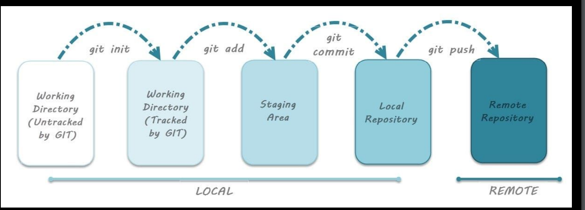

~~~
1. Creating or Uploading files on GitHub
2. Editing Files
3. Committing changes
4. Viewing commit history
5. Forking of Other Repos
6. Working with Github Desktop
7. Git inside VSCode
~~~

## 1. Creating or Uploading files on GitHub
```
using UI on github
```



