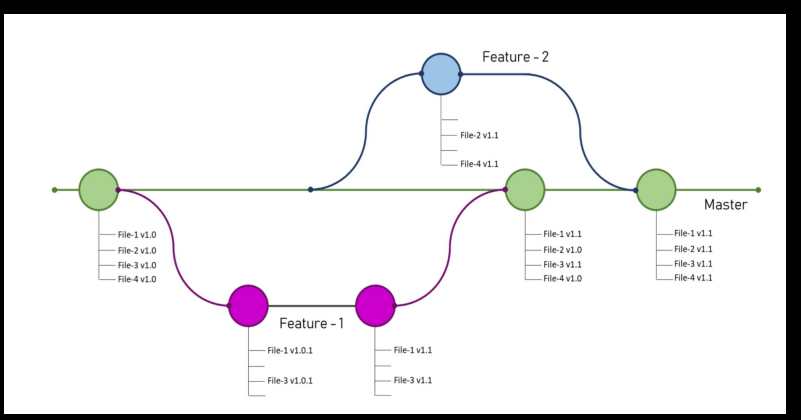
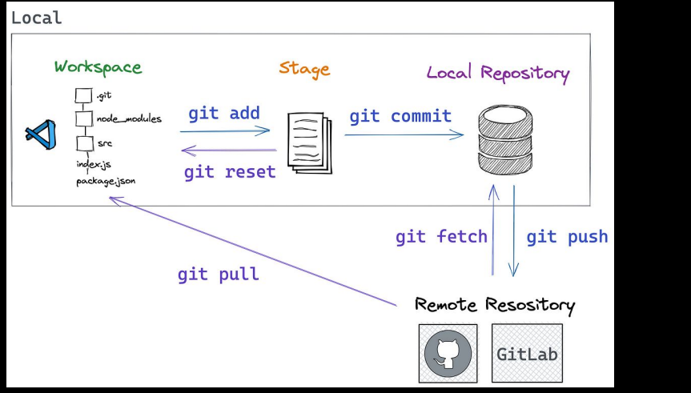

~~~
1. What are Branches
2. Branches on Github
3. git branch
4. git checkout & git switch
5. git fetch
6. git merge
7. Branch Tracking
8. Resolving conflicts
9. Pull requests and Merging on Github
10. Reviewing Code on Github

~~~

```
git branch
git branch <branch name>
git branch -d <branch name>
git branch -m <old branch name> <new branch name>
git branch -a
git branch -r
git branch --merged
git branch --no-merged
git branch --remote
git branch --set-upstream-to
git branch --unset-upstream
git branch --verbose
git branch --verbose <branch name>
git branch -v
git branch -v <branch name>
git branch -vv
git branch -vv <branch name>
git branch --edit-description
git branch --edit-description <branch name>
git branch --edit-description <branch name> <description>
git branch --edit-description <branch name> --description=<description>
git branch --edit-description <branch name> --edit
git branch --edit-description <branch name> --edit <description>
```

## difference between git checkout and git switch
```
git checkout
● Switches between branches or restores files.
● Can also create and switch to a new branch.
git switch
● A simpler command to switch between branches.
● Similar to git checkout but only for switching branches
```

### Git Fetch

```
● Downloads changes from a remote repository without merging
them.
● Updates local tracking branches.
```

## Difference between git fetch and git pull



# branch tracking info
~~~
git branch --vv
git branch -u origin branch_name
git checkout -b branch_name --track orign branch_name
~~~
