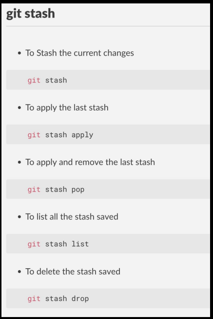
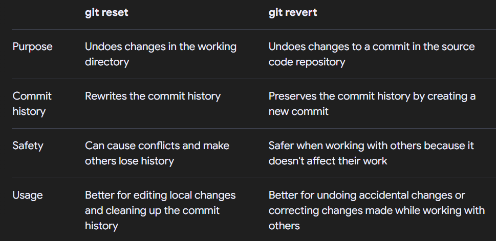
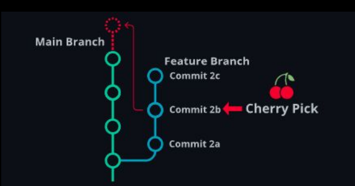
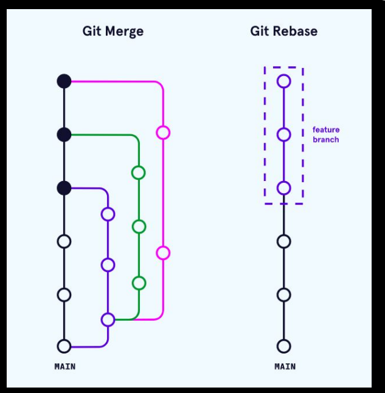

~~~
1. git reflog
2. git blame
3. git stash
4. git revert
5. git reset
6. git commit --amend
7. git cherry-pick
8. git rebase
9. Git rebase interactive
10. Keeping a clean history

~~~

## git reflog
~~~
● Purpose: Shows the history of where HEAD has pointed.

● Usage: Ideal for undoing resets or finding lost commits.
~~~

## git blame
~~~
● Purpose: Shows who last modified each line in a file, along
with the commit details.

● Usage: Useful for identifying responsibility for code changes.
~~~

## git stash

~~~
● Purpose: Temporarily saves your changes
(working directory and index) and returns your
workspace to a clean state.

● Useful when switching branches.

● Ideal for saving incomplete work without
committing it.

~~~

## git revert
Reverts a commit by
creating a new commit that
undoes the changes
introduced by a specific
commit, without altering the
commit history.
~~~
● Purpose: Reverts the last commit

● Usage: Useful for fixing merge conflicts

~~~

## git reset
~~~
● Purpose: Moves the current branch HEAD to a specific
commit.

● Mode supported (--soft, --mixed, --hard).

● Usage: Used to undo changes in commits, index, or
working directory.

~~~

### Differences between git reset and git revert

## git commit --amend
git commit --amend -m "new message"
~~~
● While git commit --amend does change history, it only
changes the most recent commit on your current branch.
● Modify the Last Commit: Edit the last commit's message
or content.
● Fix Mistakes: Useful for correcting typos or adding
forgotten changes.
● Replaces the Commit: Does not create a new commit,
just replaces the previous one.
● Avoid with Pushed Commits: Should only be used for
local commits to avoid history conflicts.
~~~

## git cherry-pick
git cherry-pick <commit-hash1> <commit-hash2> 

~~~
● Purpose: Applies changes from specific commits in one
branch to another branch.
● Useful when you want to move specific features without
merging everything.
● Usage: Great for bringing in specific features from
another branch.
~~~

## git rebase
git rebase <branch_name>

~~~
● Purpose: Reapplies commits on top of
another base commit.
● Can be used to clean up commit history
and incorporate changes from one
branch into another
~~~

## Git rebase interactive
git rebase -i <base-commit>

~~~
● Rearrange or Edit Commits: Allows
you to modify, reorder, squash, or
remove commits in a branch to clean
up the commit history.
● Useful for History Cleanup: Ideal for
refining commits before sharing or
pushing, creating a cleaner and more
understandable commit history.
● This changes history: Do not do this
after pushing.
~~~

## Keeping a clean history
~~~ 
● Avoid messy, redundant commits;
use tools like git rebase to clean up
history.
● Squash multiple small or
meaningless commits into one
meaningful commit.
● Use descriptive commit messages to
keep the history readable and easy
to follow.
● Regularly review and tidy up
branches before merging into the
main branch.
~~~

