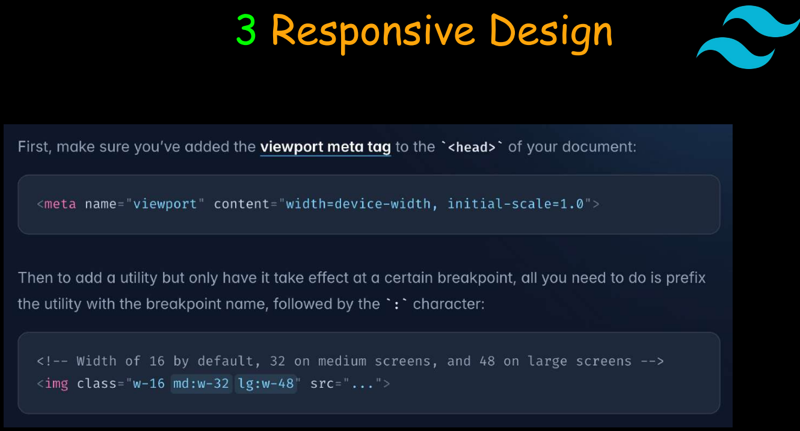

## What is Tailwind css
~~~
1. Responsive: Mobile-first design for all device sizes.
2. Utility-First: Provides low-level utility classes for
building custom designs.
3. Highly Customizable: Easily extendable through a
config file.
4. Responsive Design: Built-in responsive utilities (e.g.,
sm:, md:).
5. No Predefined Components: Focuses on building
custom components.
6. Purge CSS: Removes unused styles in production for
smaller files.
7. Fast Development: Style elements directly in markup
for speed.
~~~

#### extension name for the tailwind in vs code is tailwind css intellisense

## installing tailwind css
1. install
~~~
    npm init -y
    npm install -D tailwindcss postcss autoprefixer
~~~
2. Initialize tailwind css config
~~~
npx tailwindcss init
~~~

Configure Tailwind in the Configuration Files (tailwind.config.js)
content: [ "*.html”] 

~~~
1. make scr folder
2. make file input.css
put tailwind directives to src/input.css
*** 
@tailwind base;
@tailwind components;
@tailwind utilities;
***
3. npx tailwindcss -i ./src/input.css -o ./src/output.css --watch
4. declare shortcut 
"tailwind": "npx tailwindcss -i ./src/input.css -o ./src/output.css --watch"
5.npm run tailwind
~~~

## for responsive design
