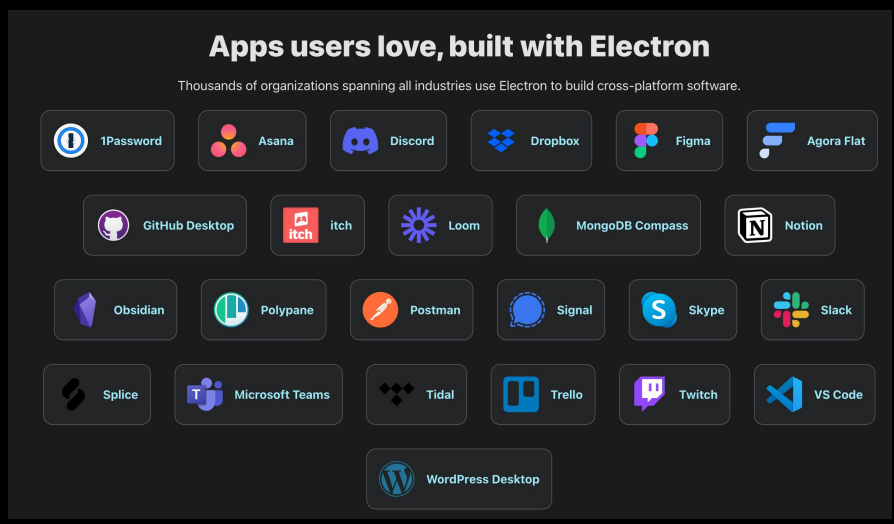

What is NodeJs?
``` 
Node.js is an open-source,
cross-platform runtime environment for executing
JavaScript code outside of a browser.
```

### Web-Specific APIs: 
APIs like localStorage, sessionStorage,and browser-based fetch are not available in Node.js.

### Desktop Applications
